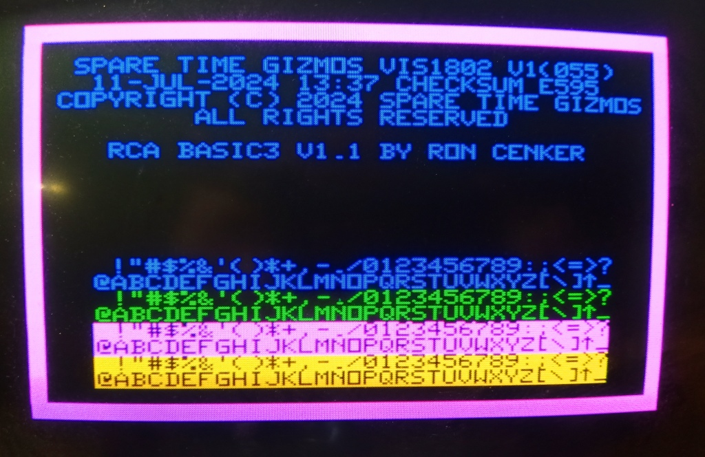

# VIS1802

The VIS1802 is a stand alone serial ASCII terminal based on the CDP1802 CPU and the RCA CDP1869/1870/1876 VIS chip set.  The VIS generates a 40x24 character text display or an 240x192 pixel graphics display with up to eight colors.  The display scan rate is 15750Hz horizontal and 60Hz vertical with either NTSC/PAL color encoding (using the CDP1870 chip) or RGB TTL colors (using the CDP1876 chip).

  The VIS text font uses a 6x8 pixel glyph with either 64 upper case only, or 128 upper and lower case characters.  The font is contained in RAM and is loaded from EPROM at startup, and custom font glyphs may be downloaded later.  The 64 character font can display two different text colors simultaneously, but the 128 character font can display only one.  The 128 character font also contains 32 special graphics characters which may be selected with the appropriate escape sequence.

  The VIS1802 uses a CDP1854 UART and a CDP1861 baud rate generator.  It can operate at all standard rates from 110 to 9600bps, and can use either CTS/DTR hardware flow control or XON/XOFF software flow control.  A PS/2 keyboard is used for input, and an AT89C4051 auxiliary processor decodes the PS/2 prototocol to generate ASCII key codes.  The VIS chipset contains a sound generator that can play simple musical tunes.

  The VIS1802 firmware also contains a copy of the RCA BASIC3 interpreter and can operate in local mode as a stand alone BASIC computer.  Up to 28K of RAM is available to BASIC for storing programs and data, and programs can be uploaded to or downloaded from a host computer over the serial port using the XMODEM protocol.  The VIS1802 BASIC has been extended to include functions that allow input and output to be redirected to either the serial port or to the PS/2 keyboard and VIS display.

  BASIC has also been extended with graphics functions to plot points and draw lines.  A BASIC PLAY statement allows playing of simple music using the VIS sound generator, and the BASIC TIME and WAIT functions keep track of the time of day using VRTC interrupts.   And lastly, a BASIC KEY function allows for non-blocking console input from either the serial port or PS/2 keyboard.

